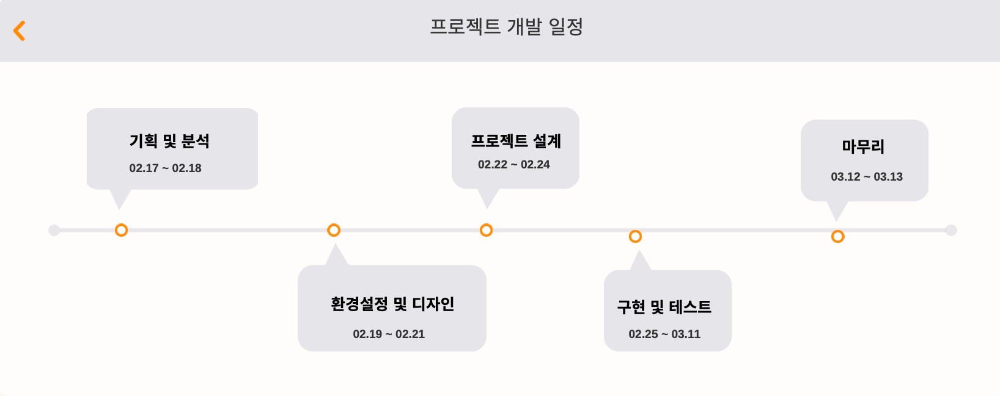

# 핸드메이드 이커머스 사이트 (뚝딱뚝딱)

---

## 프로젝트 소개

## 1. 개발 환경
### Front-END
      

### Back-end
   

### DB

### 버전 관리
  

### 협업 툴
 

[//]: # (## 2. 개발 기간 및 작업 관리)

[//]: # ()
[//]: # (## 3. 역할 분담)

[//]: # ()
[//]: # (## 4. 페이지별 기능)

